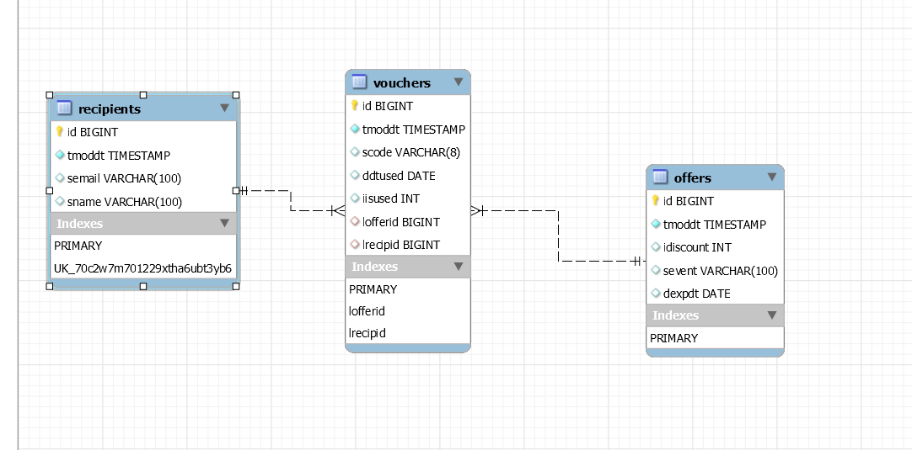

# VoucherPoolSpringAPI
<b>A Spring Boot API for Voucher Pool <b>

RESTful API using Spring Boot, JPA hibernate and H2, One to Many, Many to One bidirectional mapping

 



Bidirectional Mapping
<ul>
  <li>Recipients - Vouchers (One-To-Many)</li>
  <li>Vouchers - Recipients (Many-To-One)</li>
  <li>Offers - Vouchers (One-To-Many)</li>
  <li>Vouchers - Offers (Many-To-One)</li>
</ul>

DB can be reached after running application at :- http://localhost:3030/vp/h2

User Name : sa <br>
Password : <Blank>

<b>RESTful API endpoints<b><br><br>
A collection file for Postman has been exported and located in the above files.<br>
Port = 3030<br><br>
<table>
  <tr>
    <th><b>METHOD<b></th>
    <th><b>PATH<b></th> 
    <th><b>DESCRIPTION<b></th>
  </tr>
  <tr>
    <td>POST</td>
    <td>/vp/offers/create</td>
    <td>Creates all necessary data for testing purposes and only limit to 2 recipients</td>
  </tr>
  <tr>
    <td>GET</td>
    <td>vp/recipient/{email}</td>
    <td>Get neccesary recipient info using email</td>
  </tr>
  <tr>
    <td>GET</td>
    <td>/vp/voucherNo/{voucherNo}</td>
    <td>Get Vouchers based on voucher number</td>
  </tr>
      
  <tr>
    <td>GET</td>
    <td>/vp/vouchers/{email}</td>
    <td>Get Vouchers based on email</td>
  </tr>
  <tr>
    <td>GET</td>
    <td>/vp/validation?voucherNo=123456</td>
    <td>Validate if vouchers are expired using voucher numbers</td>
  </tr>  
  <tr>
    <td>GET</td>
    <td>/vp/usage?voucherNo=123456</td>
    <td>Validate if vouchers have been used using voucher numbers</td>
  </tr>
  <tr>
    <td>POST</td>
    <td>/vp/redeem?voucherNo=123456</td>
    <td>Redeem voucher using voucher number</td>
  </tr>
</table>

<b>Git Repo Clone <b>
<br>
 ```
git clone https://github.com/ravehaseo/VoucherPoolSpringAPI.git
 ```
